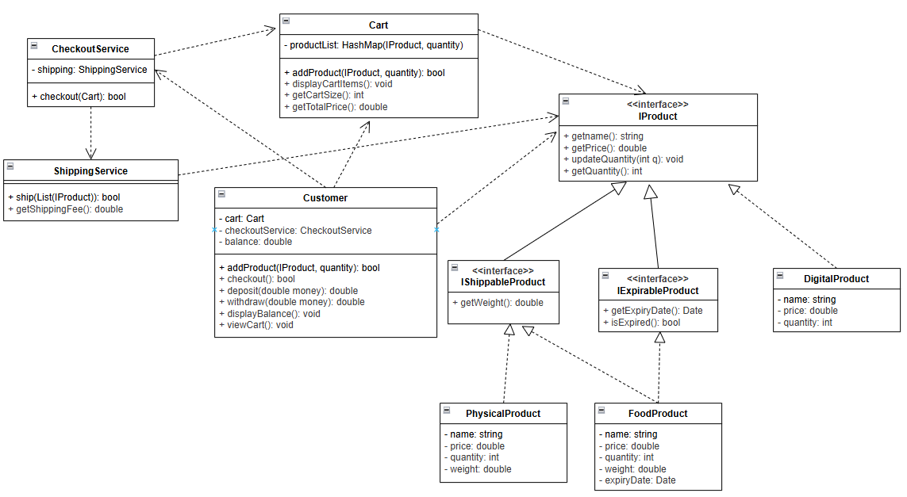

# Fawry Internship 2025 Task

This project is a simple Java-based shopping cart system, designed as part of the Fawry Internship 2025 application. It demonstrates object-oriented design, interface usage, and basic service logic for an e-commerce scenario.

## Features

- **Product Types**: Supports digital, physical, and food products, with interfaces for shippable and expirable products.
- **Cart Management**: Add products to a cart, view cart contents, and calculate totals.
- **Checkout Process**: Handles checkout with shipping fee calculation and balance deduction.
- **Shipping Service**: Ships shippable products and displays shipping details.
- **Customer Wallet**: Deposit and withdraw funds, with balance checks during checkout.

## Class Structure

- `IProduct`: Base interface for all products.
- `IShippableProduct`, `IExpirableProduct`: Interfaces for products that can be shipped or have expiry dates.
- `DigitalProduct`, `PhysicalProduct`, `FoodProduct`: Implementations of product types.
- `Cart`: Manages products and quantities.
- `CheckoutService`: Handles the checkout process and interacts with `ShippingService`.
- `ShippingService`: Calculates shipping fees and processes shipping.
- `Customer`: Represents a user with a cart and wallet.

## Class Diagram

